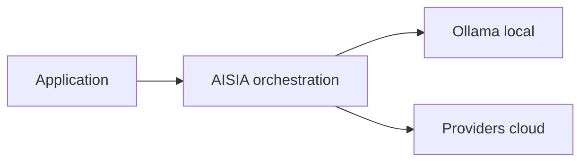

<!-- GENERATED:09_publications:start -->
<!--
  GÉNÉRÉ — ne pas éditer à la main.
  Source: scripts/generate/09_publications.py
  Régénérer: python3 scripts/aisia.py regen
  Gate deploy: python3 scripts/release/deploy.py <ver> --mode docs
-->

# terraform-google-aisia

> **v6.12.100** · code **v6.13.1** tagué, registry/images LIVE encore **v6.12.100** — module registry — bootstrap GCP + substrat AISIA

## Cœur d'AISIA (identité produit)

AISIA est le **chef d'orchestre IA local-first** en **SaaS, BaaS et PaaS** : une requête entre, le meilleur modèle (local ou cloud) exécute, la réponse sort traçable et gouvernée. Déploiement Terraform sur AWS, Azure, Google Cloud, OVH ou Scaleway — ou instance opérée.

**Fonction première** : orchestrer chaque requête IA en **local-first** (Ollama sur cluster)
puis cloud si nécessaire — via `BanditRouter`, pas un simple reverse-proxy.

**Différenciation** : orchestration local-first — pas un proxy LLM stateless.

| vs proxy LLM | AISIA |
|--------------|-------|
| 1 provider fixe | **167** moteurs IA |
| Catalogue modèles | **9563** modèles |
| Stateless | Qdrant + audit AI Act + multi-tenant |
| SaaS opaque | Déployable Swarm/K8s — runtime **v6.12.100** · code **v6.13.1** |

Documentation : [README racine](../../../../README.md) ·
[Product Identity](../../../../specification/03-Project-State/Product-Identity-AISIA.md)




---
<!-- GENERATED:09_publications:end -->

## Architecture

```
GCP Project
  └─ VPC dédié (subnet + ranges secondaires pods/services, VPC-native)
       └─ GKE Cluster (régional, remove_default_node_pool, release_channel=REGULAR)
            ├─ Node pool "primary" (e2-standard-4 × node_count, auto_repair/upgrade)
            └─ Node pool "gpu"    (g2-standard-8 + nvidia-l4, autoscale 0→4, optionnel — gpu_enabled=true)
  ├─ GCS bucket "artifacts" (uniform access, force_destroy)
  ├─ Cloud SQL Postgres 16  (conditionnel — with_managed_db=true)
  └─ Memorystore Redis 7.2  (conditionnel — with_managed_cache=true)
```

Région par défaut : `europe-west1` (conformité RGPD).

## Usage

```hcl
provider "google" {
  project = "my-gcp-project"
  region  = "europe-west1"
  # Credentials via GOOGLE_CREDENTIALS / GOOGLE_APPLICATION_CREDENTIALS
}

# L1 — substrat GKE
module "aisia_gcp" {
  source  = "app.terraform.io/AISIA/aisia/google"
  version = "~> 1.0"

  org_id      = "acme"
  service_key = "C1"
  image_tag   = "v6.13.1"
  tier        = "saas"

  project_id = "my-gcp-project"
  region     = "europe-west1"
  node_count = 2
}

# Récupérer le kubeconfig (voir output kubeconfig_command), puis :
provider "kubernetes" {
  # config_path = "~/.kube/config"  après `gcloud container clusters get-credentials ...`
}

# L2 — déploiement AISIA
module "aisia_app" {
  source  = "app.terraform.io/AISIA/aisia-cluster/kubernetes"
  version = "~> 1.0"

  image_tag = "v6.13.1"
  tier      = "saas"
  domain    = "acme.aisia.fr"
}
```

## Inputs

| Nom | Description | Type | Défaut | Requis |
|-----|-------------|------|--------|--------|
| `org_id` | Identifiant de l'organisation AISIA (tenant) | `string` | — | oui |
| `service_key` | Brique déployée (C1..C11) | `string` | — | oui |
| `project_id` | ID du projet GCP cible | `string` | — | oui |
| `runtime_kind` | edge \| compute \| compute-gpu \| data \| ops \| security | `string` | `"compute"` | non |
| `substrate` | Substrat cible (ce module = k8s) | `string` | `"k8s"` | non |
| `profile` | Profil de dimensionnement (S \| M \| L \| XL) | `string` | `"S"` | non |
| `node_count` | Nombre de nœuds du pool principal GKE | `number` | `1` | non |
| `instance_flavor` | Machine type GCE des nœuds principaux | `string` | `"e2-standard-4"` | non |
| `image_registry` | Registry des images AISIA | `string` | `"registry.aisia.fr"` | non |
| `image_tag` | Tag d'image AISIA à déployer | `string` | `"v6.13.1"` | non |
| `domain` | Domaine custom (vide = *.aisia.fr) | `string` | `""` | non |
| `tier` | Offre tarifaire (saas \| baas \| paas) | `string` | `"saas"` | non |
| `gpu_enabled` | Provisionner un pool GPU GKE | `bool` | `false` | non |
| `region` | Région GCP GKE régional (europe-west1 = RGPD) | `string` | `"europe-west1"` | non |
| `cluster_name` | Préfixe du cluster (vide = dérivé org/service) | `string` | `""` | non |
| `release_channel` | Canal GKE (RAPID \| REGULAR \| STABLE) | `string` | `"REGULAR"` | non |
| `gpu_type` | Accélérateur GPU (nvidia-tesla-t4 \| nvidia-l4 \| nvidia-tesla-a100) | `string` | `"nvidia-l4"` | non |
| `gpu_node_flavor` | Machine type des nœuds GPU (g2-standard-8 = 1× L4) | `string` | `"g2-standard-8"` | non |
| `with_managed_db` | Provisionner Cloud SQL Postgres | `bool` | `false` | non |
| `with_managed_cache` | Provisionner Memorystore Redis | `bool` | `false` | non |

## Outputs

| Nom | Description | Sensible |
|-----|-------------|----------|
| `cluster_id` | ID du cluster GKE | non |
| `cluster_name` | Nom du cluster GKE | non |
| `cluster_endpoint` | Endpoint API server GKE | oui |
| `cluster_ca_certificate` | CA certificate GKE (base64) | oui |
| `kubeconfig_command` | Commande `gcloud container clusters get-credentials` | non |
| `region` | Région GCP du déploiement | non |
| `node_count` | Taille du pool principal | non |
| `gpu_pool_enabled` | Pool GPU provisionné ? | non |
| `artifacts_bucket` | Bucket GCS d'artefacts | non |
| `db_connection_name` | Connection name Cloud SQL (vide si non provisionné) | non |
| `redis_host` | Host Memorystore Redis (vide si non provisionné) | non |

## Prérequis

- OpenTofu >= 1.5 ou Terraform >= 1.5
- Provider `hashicorp/google >= 5.0, < 7.0`
- Credentials GCP via `GOOGLE_CREDENTIALS` ou `GOOGLE_APPLICATION_CREDENTIALS`, et un projet cible
  (`project_id`) avec les APIs `container`, `compute`, `sqladmin`, `redis` activées
- Module `terraform-aisia-cluster ~> 1.0` pour déployer l'application

## Validation sans creds (docs-driven)

```bash
cd examples/basic
terraform fmt -check
terraform init -backend=false
terraform validate
```

L'`apply`/`destroy` réel est **gardé par la présence de credentials** (invariant HONEST-FAILURE) :
sans elles, aucune ressource GCP n'est créée.

## Licence

[Mozilla Public License 2.0](LICENSE) — Copyright (c) 2026 AISIA (Sébastien Lambert).

## Référence des variables & sorties (auto-générée)

<!-- BEGIN_TF_DOCS -->
### Inputs (parité `variables.tf`)

| Name | Type | Default | Description |
|------|------|---------|-------------|
| `org_id` | `string` | `—` | Identifiant de l'organisation AISIA (tenant). |
| `service_key` | `string` | `—` | Brique déployée (C1..C11). |
| `runtime_kind` | `string` | `"compute"` | edge | compute | compute-gpu | data | ops | security. |
| `substrate` | `string` | `"k8s"` | Substrat cible. Ce module provisionne le substrat 'k8s' (GKE). |
| `profile` | `string` | `"S"` | Profil de dimensionnement (S | M | L | XL). |
| `node_count` | `number` | `1` | Nombre de nœuds du pool principal GKE. |
| `instance_flavor` | `string` | `"e2-standard-4"` | Machine type GCE des nœuds du pool principal (ex : e2-standard-4). |
| `image_registry` | `string` | `"registry.aisia.fr"` | Registry des images AISIA (app déployée via terraform-aisia-cluster). |
| `image_tag` | `string` | `"v6.13.1"` | Tag d'image AISIA à déployer (ex. v6.13.1). |
| `domain` | `string` | `""` | Domaine custom de l'org (vide = *.aisia.fr). |
| `tier` | `string` | `"saas"` | Offre tarifaire AISIA (saas | baas | paas). |
| `gpu_enabled` | `bool` | `false` | Provisionner un pool GPU GKE (runtime compute-gpu / inférence C4). |
| `project_id` | `string` | `—` | ID du projet GCP cible (requis). |
| `region` | `string` | `"europe-west1"` | Région GCP GKE régional (europe-west1 par défaut pour conformité RGPD). |
| `cluster_name` | `string` | `""` | Préfixe logique du cluster GKE (sinon dérivé de org_id/service_key). |
| `release_channel` | `string` | `"REGULAR"` | Canal de release GKE (RAPID | REGULAR | STABLE). |
| `gpu_type` | `string` | `"nvidia-l4"` | Type d'accélérateur GPU (doc GCP : nvidia-tesla-t4 | nvidia-l4 | nvidia-tesla-a100). |
| `gpu_node_flavor` | `string` | `"g2-standard-8"` | Machine type des nœuds du pool GPU optionnel (g2-standard-8 = 1× L4). |
| `with_managed_db` | `bool` | `false` | Provisionner Cloud SQL Postgres (briques data). |
| `with_managed_cache` | `bool` | `false` | Provisionner Memorystore Redis (briques data/ops). |

### Outputs (parité `outputs.tf`)

| Name | Description |
|------|-------------|
| `cluster_id` | ID du cluster GKE. |
| `cluster_name` | Nom du cluster GKE. |
| `cluster_endpoint` | Endpoint du control plane GKE (sensible). |
| `cluster_ca_certificate` | CA certificate du control plane GKE (base64, sensible). |
| `kubeconfig_command` | Commande gcloud pour récupérer le kubeconfig du cluster. |
| `region` | Région GCP du déploiement. |
| `node_count` | Taille du pool de nœuds principal. |
| `gpu_pool_enabled` | Un pool GPU a-t-il été provisionné ? |
| `artifacts_bucket` | Bucket GCS d'artefacts. |
| `db_connection_name` | Connection name Cloud SQL (vide si non provisionné). |
| `redis_host` | Host Memorystore Redis (vide si non provisionné). |
<!-- END_TF_DOCS -->

<!-- TF-MODULE-DOCS:09_publications -->
## Documentation AISIA

- **Documentation produit** : [aisia.fr/docs](https://aisia.fr/docs)
- **Référence API** : [api.aisia.fr/docs](https://api.aisia.fr/docs)
- **Provider Terraform** : [aisia-foundation/aisia](https://registry.terraform.io/providers/aisia-foundation/aisia/latest/docs)
- **Guide d'implémentation** : [getting-started](https://registry.terraform.io/providers/aisia-foundation/aisia/latest/docs/guides/getting-started)
- **Version module / code** : **v6.13.1**
- **PROD LIVE documentaire** : **v6.12.100** (runtime cluster ; distinct du tag module)

<!-- TF-REGISTRY-STATUS -->
## Statut publication registry (honnête)

> Mesuré à la régénération docs · **version code TF** **v6.13.1** (`VERSION` modules + provider) · PROD LIVE documentaire **v6.12.100**.

| Artefact | Repo | Public registry.terraform.io |
|----------|------|------------------------------|
| Provider `aisia-foundation/aisia` | `6.13.1` | **6.12.96** ❌ écart |
| Module `terraform-aisia-cluster` (`cluster/aisia`) | `6.13.1` | **6.12.99** ❌ écart |
| Module `terraform-aisia-swarm` (`swarm/aisia`) | `6.13.1` | **6.12.99** ❌ écart |
| Module `terraform-aws-aisia` (`aisia/aws`) | `6.13.1` | **6.12.99** ❌ écart |
| Module `terraform-azure-aisia` (`aisia/azure`) | `6.13.1` | **6.12.99** ❌ écart |
| Module `terraform-google-aisia` (`aisia/google`) | `6.13.1` | **absent public** ⚠️ |
| Module `terraform-ovh-aisia` (`aisia/ovh`) | `6.13.1` | **6.12.99** ❌ écart |
| Module `terraform-scaleway-aisia` (`aisia/scaleway`) | `6.13.1` | **6.12.99** ❌ écart |

HCP privé (`app.terraform.io/AISIA`) : modules + provider publiés via `scripts/ops/publish_terraform.sh --apply` (mesuré hors ce tableau). Ne pas écrire « 100 % registry public » si Google public est absent.

